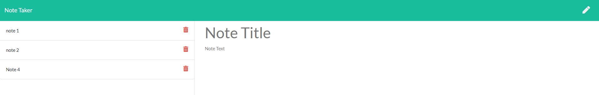

# Note-Taker
  
  
## Description
  
 A web app that uses Node and Express on the backend and is deployed to Heroku. A user can enter a note title and message, it will then be stored so they can view it when they go back to the page. They can also delete notes they no longer need.
  
## Table of Contents

- [Installation](https://github.com/kas1330/Note-Taker#installation)

- [Usage](https://github.com/kas1330/Note-Taker#usage)

- [License](https://github.com/kas1330/Note-Taker#license)

- [Contributions](https://github.com/kas1330/Note-Taker#contributions)

- [Testing](https://github.com/kas1330/Note-Taker#testing)

- [Questions](https://github.com/kas1330/Note-Taker#questions)

- [Repo](https://github.com/kas1330/Note-Taker#repo)

- [Deployed](https://github.com/kas1330/Note-Taker#deployed)

- [Demonstration](https://github.com/kas1330/Note-Taker#demonstration)

## Installation

 Use npm i to install all the needed packages.

## Usage

Use npm i to install all needed packages. Use node.js to run server.js. Then go to localhost:insertYourNumber in the browser to view the application. Or use the link to the deployed application to use it.

## License

 None

## Contributions

 Submit a pull request.

## Testing

N/A

## Questions

 https://github.com/kas1330

 k.sexton804@gmail.com

 ## Repo

 https://github.com/kas1330/Note-Taker

 ## Deployed

 https://note-taker-app123.herokuapp.com/
 
## Demonstration

